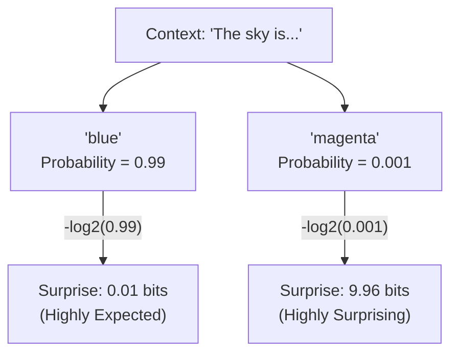

# Topic 32 · Variant C — Voice + Rigor + Source Primacy

**Topic:** Transformer Networks: History and Theory
**Module:** The Pre-Computing Generative Theory
**Subtopic:** The Dawn of Information: Quantifying Language and Surprise
**Concepts:** Information Theory and Shannon Entropy
**Learner profile:** Advanced · Exhaustive first-principles · No time limit · Senior SWE, rusty math
**Latency:** 35764ms
**Word count:** 1098

---

### 1. The 1948 Big Bang: Treating Language as a Predictable Signal

If we want to understand the 2017 "Attention Is All You Need" paper from first principles, we cannot start in 2017. To appreciate the architectural bottlenecks the Transformer solved, we first have to understand the fundamental laws of the universe it operates in. 

For language generation, that universe wasn't discovered by AI researchers in Silicon Valley. It was mapped out in 1948 by a mathematician named Claude Shannon at Bell Labs, before computers were even a commercial reality. 

Imagine you are sitting at a telegraph machine, tasked with transmitting an English sentence. As a software engineer, you know that transmitting data costs bandwidth. Naturally, you wonder: *Is there a way to mathematically compress this message?*

To answer that, you have to ask a deeper question: How much actual *information* is contained in a single word? 

If I send you the phrase, "The sky is...", you can guess with near certainty that the next word is "blue." Because you already expected it, the word "blue" tells you almost nothing new. It carries very little information.

But if the phrase is "The sky is...", and the next word turns out to be "magenta," you are caught off guard. You didn't expect it, so the word "magenta" carries a massive amount of new information. 

This was Shannon’s groundbreaking conceptual leap: **Information is mathematically identical to surprise.** The less predictable a symbol is, the more information it contains. 

To build a machine that can generate language, we first need a way to mathematically measure this "surprise."

### 2. Dusting off the Math: Quantifying Surprise

You mentioned your math foundation is strong but rusty, and that you prefer a top-down architectural intuition for the formulas. Let's rebuild the mathematical concept of "surprise" using exactly that approach.

To measure surprise, we need to look at the probability of an event happening, which we'll call $P(x)$. 
* If an event is certain to happen, $P(x) = 1$. The surprise should be $0$.
* If an event is highly unlikely, $P(x)$ is close to $0$. The surprise should be very high.

But we have an engineering problem. If we observe two independent words in a row—say, "magenta" and "elephant"—the laws of probability state that we *multiply* their individual probabilities to get the probability of both happening: $P(x, y) = P(x) \times P(y)$.

However, as humans (and as software engineers tracking payload sizes), we think of information additively. If you receive one surprising word, and then another surprising word, the total surprise you've experienced should be the *sum* of the two. 

We need a mathematical function that converts multiplication into addition. That function is the logarithm.

This leads us to Claude Shannon’s formal definition of the "Information Content" (or surprise) of a single event $x$:

$$I(x) = -\log_2(P(x))$$

**Top-down intuition for this formula:**
* We use **base 2** ($\log_2$) because computers process things in binary. The result of this equation is measured in *bits*.
* We use a **negative sign** because probabilities are always between $0$ and $1$, and the log of a fraction is a negative number. The negative sign flips it so our "surprise" is always a positive number of bits.
* If a word has a $100\%$ chance of appearing ($P = 1$), $-\log_2(1) = 0$ bits of surprise. 
* If a word has a $12.5\%$ chance of appearing ($P = 0.125$ or $1/8$), $-\log_2(1/8) = 3$ bits of surprise.

*Caption: How probability dictates the mathematical 'surprise' (information content) of the next word in a sequence.*

### 3. Shannon Entropy: The Bedrock of Generative AI

We just measured the surprise of a *single* word. But language isn't a single word; it's a vast system of possible words drawn from a vocabulary. 

If we want to evaluate how predictable a whole language is, or how well an AI model understands that language, we need to calculate the *average* surprise across every possible word that could come next. 

In physics, the measure of disorder or randomness in a system is called Entropy. Borrowing this concept, Shannon introduced **Information Entropy** (often called Shannon Entropy).

The entropy of a system, denoted as $H(X)$, is simply the weighted average of the surprise for all possible outcomes. 

$$H(X) = - \sum_{x} P(x) \log_2 P(x)$$

**Let's read this formula left-to-right in plain English:**
1. $\sum_{x}$ means "Sum up the following calculation for every possible word $x$ in our vocabulary."
2. $P(x)$ is the weight. How often does this word actually happen?
3. $\log_2 P(x)$ is the surprise when it *does* happen.
4. By multiplying them and summing them up, we get the expected, average amount of surprise (in bits) per word.

**Why does this matter for the evolution of AI?**
If you have a sequence of symbols that is purely random (like static on an old TV), the entropy is maximized. You can't predict what comes next. If language were purely random, AI as we know it could not exist, because there would be no underlying patterns to learn.

But Shannon analyzed English text and proved mathematically that it is highly redundant. He estimated that the entropy of English text, when you know the preceding context, drops to roughly 1.0 to 1.5 bits per character. 

This was the spark that ignited the entire field of generative language modeling. Shannon proved that because language has low entropy, the "next token" is heavily constrained by the tokens that came before it. 

### 4. The First-Principles Bottleneck

If you zoom out and look at modern LLMs today—whether it's an early Recurrent Neural Network (RNN) or the latest Transformer—they are all doing exactly one thing at their core: **They are Entropy-Reduction Engines.** 

Their singular goal during training is to look at a sequence of text, calculate the probability distribution of the next word, and minimize the Shannon Entropy of that distribution compared to the actual text. When a model becomes "smarter," what we are technically saying is that the model is *less surprised* by human language. 

But Shannon’s 1948 mathematics left us with a massive engineering bottleneck. 

We now have a mathematical formula for surprise, but that formula relies entirely on knowing $P(x)$—the true probability of the next word. How do we actually calculate $P(\text{"blue"})$ versus $P(\text{"magenta"})$ based on the context of the words that came before it? 

Shannon gave us the law of gravity for language, but he didn't give us the rocket ship. To see the first mathematical attempt at predicting those probabilities, we have to rewind the clock even further, to 1913, and examine a concept that still forms the backbone of how LLMs consume text today: The Markov Property.